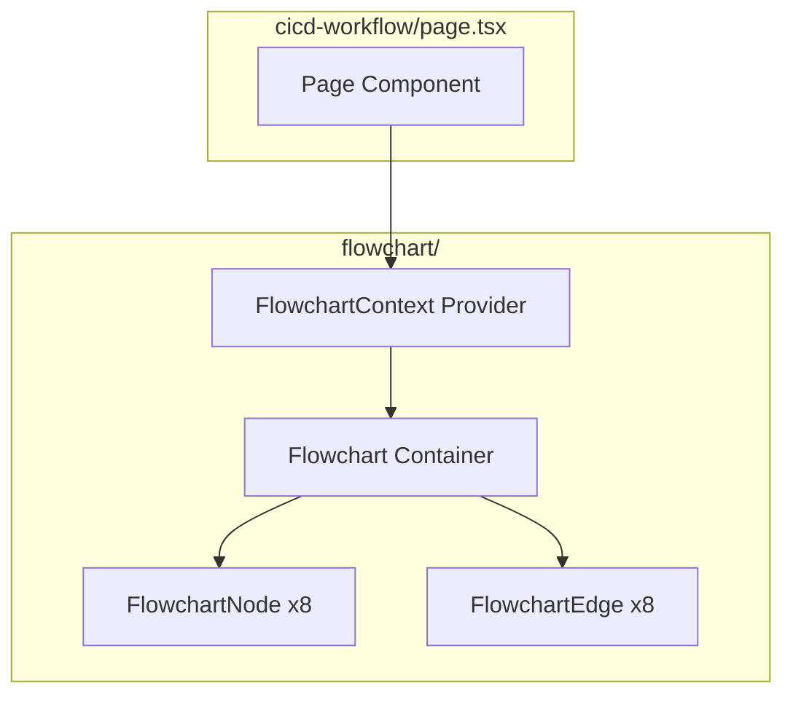
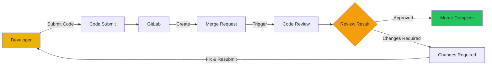

# cicd-workflow - Task 6

Execute task 6 for the cicd-workflow specification.

## Task Description
Create FlowchartEdge component

## Requirements Reference
**Requirements**: AC-3, AC-5

## Usage
```
/Task:6-cicd-workflow
```

## Instructions

Execute with @spec-task-executor agent the following task: "Create FlowchartEdge component"

```
Use the @spec-task-executor agent to implement task 6: "Create FlowchartEdge component" for the cicd-workflow specification and include all the below context.

# Steering Context
## Steering Documents Context

No steering documents found or all are empty.

# Specification Context
## Specification Context (Pre-loaded): cicd-workflow

### Requirements
# CI/CD Workflow Page - Requirements Specification

## Feature Overview

A new page displaying an interactive CI/CD pipeline flowchart that visualizes the code development and deployment workflow from feature code submission to merge request completion.

---

## Alignment with Product Vision

This feature supports the Tapestry GC Technology Enterprise Portal's goal of showcasing technical capabilities to visitors. The CI/CD workflow visualization demonstrates the organization's mature development processes and DevOps practices, reinforcing the portal's purpose as a technical introduction and capability showcase.

---

## User Stories

### US-1: View CI/CD Workflow Pipeline
**As a** user visiting the portal,
**I want** to see a visual representation of the CI/CD workflow,
**So that** I can understand the development process and how code moves from development to production.

### US-2: Interact with Pipeline Steps
**As a** user viewing the workflow,
**I want** to click on each step in the pipeline,
**So that** I can see the flow progression and understand what happens at each stage.

### US-3: Visual Feedback on Interactions
**As a** user interacting with the workflow,
**I want** to see visual animations when triggering pipeline steps,
**So that** the experience is engaging and helps me understand the sequence of operations.

---

## Acceptance Criteria

### AC-1: Page Navigation
- **WHEN** the user navigates to the portal
- **THEN** the system SHALL display a "CI/CD Workflow" navigation item in the sidebar
- **AND** clicking the item SHALL navigate the user to `/cicd-workflow`

### AC-2: Page Layout
- **WHEN** the user opens the CI/CD Workflow page
- **THEN** the system SHALL display a professional flowchart within the main content area
- **AND** the flowchart SHALL be centered and responsive to different screen sizes

### AC-3: Pipeline Flow Display
- **WHEN** the page loads
- **THEN** the system SHALL display the complete pipeline with the following nodes:
  1. Developer (actor icon)
  2. Code Submit action to GitLab (GitLab icon)
  3. Merge Request creation
  4. Code Review trigger
  5. Decision point: Changes Required vs. Approved
  6. Loop back for changes or Merge Request completion

### AC-4: Visual Design
- **WHEN** the flowchart is displayed
- **THEN** each node SHALL have an appropriate icon from lucide-react
- **AND** the design SHALL use the brand yellow (#EAB308) for accents
- **AND** the overall style SHALL be professional and suitable for demonstrations

### AC-5: Interactive Animation
- **WHEN** the user clicks on a pipeline node
- **THEN** the system SHALL trigger an animation showing progression to the next step
- **AND** the animation SHALL be smooth and visually clear

### AC-6: Responsive Design
- **WHEN** the page is viewed on different screen sizes
- **THEN** the flowchart SHALL scale appropriately
- **AND** all elements SHALL remain readable and accessible

### AC-7: Animation State Management
- **IF** the user clicks on a node while an animation is in progress
- **THEN** the system SHALL ignore the click until the current animation completes
- **AND** the system SHALL provide visual indication that animation is in progress

### AC-8: Rendering Error Handling
- **IF** the flowchart fails to render
- **THEN** the system SHALL display an appropriate error message
- **AND** the system SHALL log the error for debugging purposes

---

## Non-Functional Requirements

### Performance
- The flowchart SHALL render within 1 second on standard connections
- Animations SHALL maintain 60fps performance using CSS transitions
- Initial page load SHALL complete within 2 seconds

### Security
- No user input is collected, therefore no XSS/injection vulnerabilities applicable
- The page SHALL not expose any sensitive configuration or API keys

### Reliability
- The flowchart SHALL render correctly across Chrome, Firefox, Safari, and Edge (latest 2 versions)
- The component SHALL handle SVG rendering failures gracefully

### Usability
- All interactive elements SHALL be keyboard navigable (Tab and Enter keys)
- Visual feedback SHALL be provided within 100ms of user interaction
- Color contrast SHALL meet WCAG 2.1 AA standards
- Animation preferences (prefers-reduced-motion) SHALL be respected

---

## Technical Constraints

1. **No External Flowchart Libraries**: Implement custom SVG-based flowchart to maintain minimal dependencies
2. **Icon Library**: Use existing lucide-react package for all icons
3. **Styling**: Use Tailwind CSS with brand colors from constants.ts
4. **Performance**: Animations should use CSS transitions for 60fps performance
5. **Accessibility**: All interactive elements must be keyboard navigable

---

## Out of Scope

- Real integration with GitLab API
- Actual code review functionality
- User authentication
- Multiple workflow configurations
- Save/export workflow state

---

## Dependencies

- Existing layout components (Header, Sidebar, MainContent)
- Navigation system in constants.ts
- Brand configuration in constants.ts
- lucide-react icon library

---

## Definition of Done

- [ ] Page renders at `/cicd-workflow` route
- [ ] Navigation item appears in sidebar
- [ ] Flowchart displays all pipeline nodes with icons
- [ ] Click interactions trigger step progression animations
- [ ] Responsive on mobile, tablet, and desktop
- [ ] No console errors
- [ ] Follows existing code patterns and conventions

---

### Design
# CI/CD Workflow Page - Design Specification

## Overview

The CI/CD Workflow page follows the existing project architecture pattern with a page component that renders within the shared layout. The flowchart is implemented as a self-contained React component using SVG for vector graphics and CSS transitions for animations.

---

## Architecture

### File Structure

```
src/
├── app/
│   └── cicd-workflow/
│       └── page.tsx              # Route page component
├── components/
│   ├── flowchart/
│   │   ├── Flowchart.tsx         # Main flowchart container
│   │   ├── FlowchartNode.tsx     # Individual node component
│   │   ├── FlowchartEdge.tsx     # Connection line component
│   │   └── FlowchartContext.tsx  # State management for interactions
│   ├── Header.tsx                # (existing)
│   ├── Sidebar.tsx               # (existing - modified)
│   └── MainContent.tsx           # (existing)
└── lib/
    └── constants.ts              # (existing - modified)
```

### Component Hierarchy



---

## Steering Document Alignment

### Technical Standards (AGENTS.md)

- **Next.js Patterns**: Follows App Router conventions with `page.tsx` in route directory
- **Breaking Changes Awareness**: Uses Next.js 16+ patterns, avoiding deprecated APIs

### Project Instructions (CLAUDE.md)

- **Brand Configuration**: Uses `BRAND.colors.primary` (#EAB308) from constants.ts
- **Layout Integration**: Respects `LAYOUT.headerHeight` (64px) for viewport calculations
- **Navigation Pattern**: Follows `NAVIGATION_ITEMS` structure for sidebar integration
- **Icon Usage**: Uses lucide-react as specified in tech stack

### Existing Code Patterns

- **Context Pattern**: Follows `SidebarProvider.tsx` pattern for `FlowchartContext`
- **Component Structure**: Matches `NavItem.tsx` pattern for props interfaces and styling
- **Styling Approach**: Uses Tailwind CSS with project conventions

---

## Code Reuse Analysis

### Existing Components to Leverage

| Component | File | Reuse Pattern |
|---|---|---|
| SidebarProvider | `SidebarProvider.tsx` | Context pattern reference for FlowchartContext |
| NavItem | `NavItem.tsx` | Active state styling pattern, hover transitions |
| Header | `Header.tsx` | Brand color usage reference |
| constants.ts | `lib/constants.ts` | BRAND and LAYOUT constants |

### Integration Points

**Navigation Integration**:

Add to `NAVIGATION_ITEMS` in `constants.ts`:
```tsx
{
  id: 'cicd-workflow',
  label: 'CI/CD Workflow',
  href: '/cicd-workflow',
  icon: 'GitBranch',
}
```

Add icon mapping in `Sidebar.tsx`:
```tsx
import { Home, GitBranch, PanelLeftClose, PanelLeft } from 'lucide-react';

const iconMap = {
  Home,
  GitBranch,
};
```

**Layout Integration**: Page automatically integrates via Next.js App Router.

---

## Data Models

### FlowchartNode

```typescript
interface FlowchartNode {
  id: string;                    // Unique identifier
  label: string;                 // Display text
  icon: LucideIcon;              // React icon component
  type: 'actor' | 'action' | 'decision' | 'endpoint';
  position: { x: number; y: number };  // SVG coordinates
}
```

### FlowchartEdge

```typescript
interface FlowchartEdge {
  id: string;                    // Unique identifier
  from: string;                  // Source node ID
  to: string;                    // Target node ID
  label?: string;                // Optional edge label
  type: 'forward' | 'loop';      // Edge style type
}
```

### Nodes Configuration

| ID | Label | Icon | Type | Position (x, y) |
|---|---|---|---|---|
| developer | Developer | `User` | actor | (50, 200) |
| code-submit | Code Submit | `GitBranch` | action | (200, 200) |
| gitlab | GitLab | `Code2` | action | (350, 200) |
| merge-request | Merge Request | `GitPullRequest` | action | (500, 200) |
| code-review | Code Review | `Code` | action | (500, 320) |
| decision | Review Result | `CircleHelp` | decision | (500, 440) |
| changes-required | Changes Required | `RotateCcw` | action | (350, 440) |
| merge-complete | Merge Complete | `CheckCircle` | endpoint | (650, 440) |

### Edges Configuration

| ID | From | To | Label | Type |
|---|---|---|---|---|
| e1 | developer | code-submit | Submit | forward |
| e2 | code-submit | gitlab | Push | forward |
| e3 | gitlab | merge-request | Create | forward |
| e4 | merge-request | code-review | Trigger | forward |
| e5 | code-review | decision | Review | forward |
| e6 | decision | merge-complete | Approved | forward |
| e7 | decision | changes-required | Changes Required | forward |
| e8 | changes-required | developer | Resubmit | loop |

---

## Components and Interfaces

### 1. Page Component (`src/app/cicd-workflow/page.tsx`)

**Purpose**: Route entry point that renders the flowchart within the main content area.

**Interfaces**: None (Next.js page component)

**Dependencies**:
- `Flowchart` component
- `BRAND` constants for styling

**Reuses**:
- Follows existing page structure pattern from `src/app/page.tsx`

```tsx
export default function CICDWorkflowPage() {
  return (
    <div className="flex flex-col items-center justify-center min-h-[calc(100vh-64px)] p-8">
      <h1 className="text-2xl font-semibold text-gray-800 mb-8">
        CI/CD Workflow
      </h1>
      <Flowchart />
    </div>
  );
}
```

---

### 2. Flowchart Component (`src/components/flowchart/Flowchart.tsx`)

**Purpose**: Main container that orchestrates the pipeline visualization.

**Interfaces**:
```tsx
interface FlowchartProps {
  className?: string;
}
```

**Dependencies**:
- `FlowchartNode` component
- `FlowchartEdge` component
- `FlowchartContext` provider
- `nodes` and `edges` data arrays

**Reuses**:
- SVG pattern for scalable graphics
- Context pattern from `SidebarProvider`

**State**:
```tsx
const [activeNode, setActiveNode] = useState<string | null>(null);
const [isAnimating, setIsAnimating] = useState(false);
const [error, setError] = useState<Error | null>(null);
```

---

### 3. FlowchartNode Component (`src/components/flowchart/FlowchartNode.tsx`)

**Purpose**: Renders individual pipeline nodes with icons and labels.

**Interfaces**:
```tsx
interface FlowchartNodeProps {
  node: FlowchartNode;
  isActive: boolean;
  isAnimating: boolean;
  onClick: (id: string) => void;
}
```

**Dependencies**:
- lucide-react icons
- `BRAND.colors.primary` for active styling

**Reuses**:
- Hover/active state pattern from `NavItem.tsx`
- Tailwind transition classes

---

### 4. FlowchartEdge Component (`src/components/flowchart/FlowchartEdge.tsx`)

**Purpose**: Renders connecting lines between nodes with optional labels.

**Interfaces**:
```tsx
interface FlowchartEdgeProps {
  edge: FlowchartEdge;
  isHighlighted: boolean;
  startX: number;
  startY: number;
  endX: number;
  endY: number;
}
```

**Dependencies**: None

**Reuses**:
- SVG path rendering patterns
- CSS transition for highlight animation

---

### 5. FlowchartContext (`src/components/flowchart/FlowchartContext.tsx`)

**Purpose**: Manages interaction state and animation coordination.

**Interfaces**:
```tsx
interface FlowchartContextValue {
  activeNode: string | null;
  setActiveNode: (id: string | null) => void;
  isAnimating: boolean;
  startAnimation: (nodeId: string) => void;
  triggerNextStep: () => void;  // Advances to next node in sequence
}
```

**Dependencies**:
- React Context API
- Node sequence mapping

**Reuses**:
- Context pattern structure from `SidebarProvider.tsx`

---

## Error Handling

### Error Boundary

Wrap the Flowchart component in an Error Boundary to catch SVG rendering failures:

```tsx
// src/components/flowchart/FlowchartErrorBoundary.tsx
interface ErrorBoundaryState {
  hasError: boolean;
  error: Error | null;
}

class FlowchartErrorBoundary extends React.Component<
  { children: React.ReactNode },
  ErrorBoundaryState
> {
  state = { hasError: false, error: null };

  static getDerivedStateFromError(error: Error) {
    return { hasError: true, error };
  }

  componentDidCatch(error: Error, errorInfo: React.ErrorInfo) {
    console.error('Flowchart rendering error:', error, errorInfo);
  }

  render() {
    if (this.state.hasError) {
      return (
        <div className="flex flex-col items-center justify-center p-8 text-center">
          <p className="text-red-600 mb-4">
            Unable to display the workflow diagram.
          </p>
          <button
            onClick={() => window.location.reload()}
            className="px-4 py-2 bg-yellow-500 text-white rounded-lg hover:bg-yellow-600"
          >
            Retry
          </button>
        </div>
      );
    }
    return this.props.children;
  }
}
```

### Error Logging

- Console.error for development debugging
- Component stack trace included via `componentDidCatch`

---

## Visual Design

### Color Palette

| Element | Color | Tailwind Class | Usage |
|---|---|---|---|
| Primary Accent | `#EAB308` | `yellow-500` | Active nodes, highlighted edges |
| Background | `#FFFFFF` | `white` | Node backgrounds, page |
| Text Primary | `#171717` | `gray-900` | Labels, headings |
| Text Secondary | `#6B7280` | `gray-500` | Subtitles, edge labels |
| Border Default | `#E5E7EB` | `gray-200` | Node borders |
| Success | `#22C55E` | `green-500` | Merge complete node |
| Warning | `#F59E0B` | `amber-500` | Changes required indicator |

### Typography

| Element | Size | Weight | Color |
|---|---|---|---|
| Page Title | 24px (text-2xl) | semibold | gray-800 |
| Node Labels | 14px (text-sm) | medium | gray-700 |
| Edge Labels | 12px (text-xs) | normal | gray-500 |

### Node Dimensions

| Type | Width | Height |
|---|---|---|
| Actor | 100px | 80px |
| Action | 120px | 70px |
| Decision | 100px (diamond) | 100px |
| Endpoint | 120px | 70px |

---

## Interaction Design

### Step Progression Animation

```
User clicks node → Node becomes active (yellow) →
Edge to next node highlights → Next node pulses →
Animation completes → State ready for next interaction
```

### Animation Timeline

| Phase | Duration | CSS Property |
|---|---|---|
| Node Click Feedback | < 100ms | immediate state update |
| Edge Highlight | 300ms | `stroke-dashoffset` transition |
| Next Node Pulse | 500ms | `@keyframes pulse` animation |
| Animation Lock | Total ~800ms | `isAnimating: true` |

### Animation-in-Progress Indication

When `isAnimating === true`:
- Container receives `opacity: 0.9` and `cursor: wait`
- Active node shows pulsing ring animation
- Other nodes are disabled (`pointer-events: none`)

### CSS Keyframes

```css
@keyframes pulse {
  0%, 100% { box-shadow: 0 0 0 0 rgba(234, 179, 8, 0.4); }
  50% { box-shadow: 0 0 0 8px rgba(234, 179, 8, 0); }
}

@keyframes flow {
  to { stroke-dashoffset: 0; }
}
```

---

## Responsive Design

### SVG ViewBox Strategy

```tsx
<svg viewBox="0 0 800 500" className="w-full max-w-4xl h-auto">
```

### Breakpoint Behavior

| Viewport | Container Width | Node Scale |
|---|---|---|
| Desktop (> 1024px) | max-w-4xl (896px) | 100% |
| Tablet (768-1024px) | full width | 85% |
| Mobile (< 768px) | full width | 70% (vertical flow) |

---

## Pipeline Flow Visualization



---

## Accessibility Implementation

### Keyboard Navigation

```tsx
// Tab order follows node sequence
tabIndex={0}
onKeyDown={(e) => {
  if (e.key === 'Enter' || e.key === ' ') {
    onClick(node.id);
  }
}}
```

### Screen Reader Support

```tsx
// Each node has aria-label
<button aria-label={`Step: ${node.label}. Press to animate next step.`}>

// Live region for animation announcements
<div role="status" aria-live="polite" className="sr-only">
  {isAnimating ? `Animating to ${nextNodeLabel}` : ''}
</div>
```

### Reduced Motion

```css
@media (prefers-reduced-motion: reduce) {
  * {
    animation-duration: 0.01ms !important;
    transition-duration: 0.01ms !important;
  }
}
```

---

## Performance Considerations

1. **SVG Rendering**: Inline SVG for fastest render (no network fetch)
2. **CSS Transitions**: Hardware-accelerated via `transform` and `opacity`
3. **Event Handling**: Clicks ignored during animation (`isAnimating` check)
4. **Bundle Size**: No additional dependencies (lucide-react already installed)
5. **Memoization**: Node/edge components memoized to prevent re-renders

---

## File Size Estimates

| File | Lines | Size |
|---|---|---|
| `page.tsx` | ~25 | 0.6 KB |
| `Flowchart.tsx` | ~100 | 3 KB |
| `FlowchartNode.tsx` | ~70 | 2 KB |
| `FlowchartEdge.tsx` | ~50 | 1.5 KB |
| `FlowchartContext.tsx` | ~40 | 1 KB |
| `FlowchartErrorBoundary.tsx` | ~35 | 1 KB |
| **Total** | ~320 | ~9 KB |

---

## Testing Considerations

### Unit Tests

- Node rendering with correct icons and labels
- Click handler triggers animation state change
- Edge highlighting during animation
- Error boundary catches rendering errors

### Integration Tests

- Full flowchart renders correctly
- Navigation to `/cicd-workflow` works
- Responsive scaling across breakpoints

### Accessibility Tests

- Keyboard navigation works (Tab + Enter)
- Screen reader announces node labels and animation state
- Focus visible on all interactive elements

**Note**: Specification documents have been pre-loaded. Do not use get-content to fetch them again.

## Task Details
- Task ID: 6
- Description: Create FlowchartEdge component
- Requirements: AC-3, AC-5

## Instructions
- Implement ONLY task 6: "Create FlowchartEdge component"
- Follow all project conventions and leverage existing code
- Mark the task as complete using: claude-code-spec-workflow get-tasks cicd-workflow 6 --mode complete
- Provide a completion summary
```

## Task Completion
When the task is complete, mark it as done:
```bash
claude-code-spec-workflow get-tasks cicd-workflow 6 --mode complete
```

## Next Steps
After task completion, you can:
- Execute the next task using /cicd-workflow-task-[next-id]
- Check overall progress with /spec-status cicd-workflow
