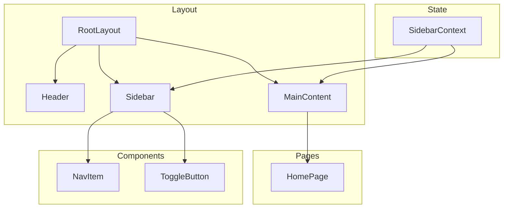

# Design Document

## Overview

This document describes the technical design for the Tapestry GC Technology enterprise portal - a Next.js application with a minimalist white-background design and yellow brand theme. The portal features a fixed header, collapsible sidebar navigation, and a main content area for page rendering.

## Steering Document Alignment

### Technical Standards (tech.md)
No existing tech.md - this is a greenfield project. The design follows Next.js 14+ App Router best practices with TypeScript and Tailwind CSS.

### Project Structure (structure.md)
No existing structure.md - the project follows standard Next.js App Router conventions with a `src/` directory for application code.

## Code Reuse Analysis

This is a new project with no existing code to reuse. The design leverages:
- **Next.js built-in optimizations:** Image component, font optimization, routing
- **Tailwind CSS utilities:** Pre-built utility classes for rapid styling
- **Lucide React icons:** Lightweight icon library for UI elements

### Existing Components to Leverage
- None (new project)

### Integration Points
- **Assets:** `assets/coach.png` will be moved to `public/coach.png` for Next.js static asset serving

## Architecture



### Layout Architecture

```
┌─────────────────────────────────────────────────────────────┐
│                        HEADER (64px)                         │
│  Tapestry GC Technology                                      │
│  ─────────────────────────────────────────────────────────  │ ← Yellow accent bar
├──────────────┬──────────────────────────────────────────────┤
│              │                                               │
│   SIDEBAR    │              MAIN CONTENT                     │
│   (256px     │                                               │
│   expanded)  │         [Page Content Rendered Here]          │
│              │                                               │
│   ○ Homepage │                                               │
│              │                                               │
│   [≡] Toggle │                                               │
│              │                                               │
└──────────────┴──────────────────────────────────────────────┘
```

## Components and Interfaces

### Component 1: RootLayout
- **Purpose:** Root layout wrapper that provides the overall page structure
- **Location:** `src/app/layout.tsx`
- **Interfaces:** Standard Next.js LayoutProps
- **Dependencies:** Header, Sidebar, SidebarProvider
- **Reuses:** None (new)

### Component 2: Header
- **Purpose:** Fixed top bar displaying portal name with yellow accent
- **Location:** `src/components/Header.tsx`
- **Interfaces:** None (static component)
- **Dependencies:** None
- **Reuses:** None (new)
- **Props:**
  ```typescript
  // No props needed - static component
  ```

### Component 3: Sidebar
- **Purpose:** Collapsible navigation panel with toggle functionality
- **Location:** `src/components/Sidebar.tsx`
- **Interfaces:** Uses SidebarContext for state
- **Dependencies:** SidebarContext, NavItem, ToggleButton, lucide-react icons
- **Reuses:** None (new)
- **Props:**
  ```typescript
  interface SidebarProps {
    // No props - reads from context
  }
  ```

### Component 4: SidebarProvider
- **Purpose:** Context provider for sidebar expand/collapse state
- **Location:** `src/components/SidebarProvider.tsx`
- **Interfaces:**
  ```typescript
  interface SidebarContextType {
    isExpanded: boolean;
    toggle: () => void;
  }
  ```
- **Dependencies:** React createContext
- **Reuses:** None (new)

### Component 5: NavItem
- **Purpose:** Individual navigation link in sidebar
- **Location:** `src/components/NavItem.tsx`
- **Interfaces:**
  ```typescript
  interface NavItemProps {
    href: string;
    icon: React.ReactNode;
    label: string;
  }
  ```
- **Dependencies:** Next.js Link, usePathname
- **Reuses:** None (new)

### Component 6: HomePage
- **Purpose:** Homepage displaying centered coach.png image
- **Location:** `src/app/page.tsx`
- **Interfaces:** None
- **Dependencies:** Next.js Image component
- **Reuses:** None (new)

## Data Models

### Navigation Item Model
```typescript
interface NavigationItem {
  id: string;
  label: string;
  href: string;
  icon: string; // Lucide icon name
}
```

### Brand Configuration
```typescript
interface BrandConfig {
  name: string;
  primaryColor: string;
  accentColor: string;
  headerHeight: string;
  sidebarWidth: {
    expanded: string;
    collapsed: string;
  };
}
```

## File Structure

```
src/
├── app/
│   ├── layout.tsx          # Root layout with Header + Sidebar
│   ├── page.tsx            # Homepage
│   └── globals.css         # Global styles
├── components/
│   ├── Header.tsx          # Fixed header component
│   ├── Sidebar.tsx         # Collapsible sidebar
│   ├── SidebarProvider.tsx # Sidebar state context
│   └── NavItem.tsx         # Navigation item component
├── lib/
│   └── constants.ts        # Brand colors, navigation config
└── types/
    └── index.ts            # TypeScript interfaces
public/
├── coach.png               # Brand image (moved from assets/)
└── favicon.ico             # Default Next.js favicon
```

## Styling Approach

### Tailwind Configuration
```typescript
// tailwind.config.ts additions
const config = {
  theme: {
    extend: {
      colors: {
        brand: {
          yellow: '#EAB308',
        },
      },
    },
  },
}
```

### Key CSS Classes
| Element | Tailwind Classes |
|---------|-----------------|
| Header | `fixed top-0 left-0 right-0 h-16 bg-white border-b-4 border-yellow-500 z-50` |
| Header Title | `text-xl font-semibold text-gray-800 pl-6` |
| Sidebar (expanded) | `fixed left-0 top-16 bottom-0 w-64 bg-white border-r border-gray-200` |
| Sidebar (collapsed) | `fixed left-0 top-16 bottom-0 w-16 bg-white border-r border-gray-200` |
| Main Content | `ml-64 pt-16 min-h-screen bg-white` (adjusted based on sidebar state) |
| NavItem | `flex items-center gap-3 px-4 py-3 text-gray-700 hover:bg-gray-100 rounded-lg` |
| NavItem Active | `bg-yellow-50 text-yellow-600 border-r-4 border-yellow-500` |

## Error Handling

### Error Scenarios

1. **Image Loading Failure**
   - **Handling:** Next.js Image component with `alt` text fallback
   - **User Impact:** Shows alt text "Coach Image" if image fails to load

2. **Navigation to Non-existent Route**
   - **Handling:** Next.js default 404 page (can customize later)
   - **User Impact:** Shows 404 page with option to return home

## Testing Strategy

### Unit Testing
- Test SidebarProvider context toggle functionality
- Test NavItem active state detection based on pathname

### Integration Testing
- Test layout renders correctly with Header + Sidebar + MainContent
- Test sidebar expand/collapse affects main content margin

### End-to-End Testing
- Test full page load and visual rendering
- Test sidebar toggle interaction
- Test navigation to homepage

## Design Decisions Summary

| Decision | Choice | Rationale |
|----------|--------|-----------|
| Framework | Next.js 14+ App Router | Modern React patterns, Server Components, built-in optimization |
| Styling | Tailwind CSS | Rapid development, consistent utilities, easy customization |
| State Management | React Context | Simple state (sidebar toggle) doesn't need external library |
| Icons | Lucide React | Lightweight, tree-shakeable, good icon variety |
| Yellow Brand Color | #EAB308 (yellow-500) | User selected - vibrant, professional yellow |
| Sidebar Width | 256px expanded | User selected - standard sidebar width |
| Header Title Alignment | Left-aligned | User selected - professional, clean look |