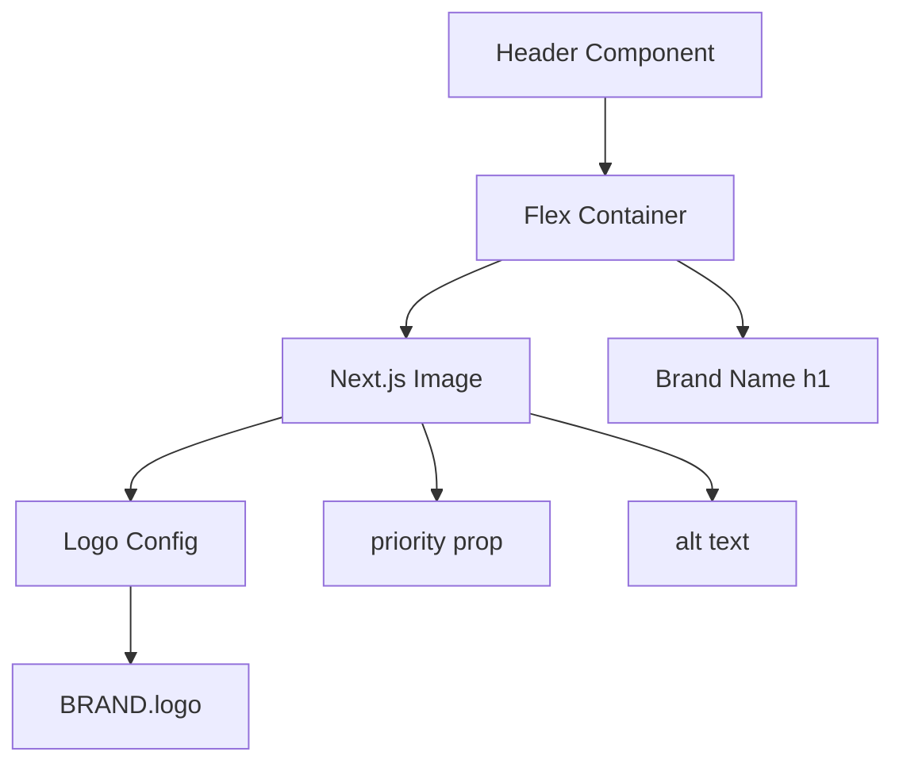

# Design Document

## Overview

This feature adds a logo image to the Header component. The logo will be placed to the left of the existing brand name text, using Next.js Image component with priority loading for optimal performance and no layout shift.

## Steering Document Alignment

### Technical Standards (tech.md)
- Uses Next.js App Router conventions
- TypeScript with strict mode
- Tailwind CSS for styling
- Next.js Image component for optimization

### Project Structure (structure.md)
- Component located in `src/components/Header.tsx`
- Uses existing brand constants from `src/lib/constants.ts`
- Logo asset in `public/logo.png`

## Code Reuse Analysis

### Existing Components to Leverage
- **Header.tsx**: Existing header component with flexbox layout - add logo to the existing container
- **constants.ts**: Brand configuration - extend with logo configuration
- **Next.js Image**: Built-in component for image optimization with priority prop

### Integration Points
- **public/logo.png**: Logo asset already exists in the public directory
- **BRAND constant**: Existing brand configuration will be extended with logo properties

## Architecture



## Components and Interfaces

### Header Component (Modified)
- **Purpose:** Display logo and brand name in fixed header
- **Interfaces:** No props (existing component has no props)
- **Dependencies:** `@/lib/constants`, `next/image`
- **Reuses:** Existing flexbox layout structure (`flex items-center h-full px-6`)

**Key Changes:**
- Import Image from `next/image`
- Add Image component before the brand name h1
- Add `gap-3` to container for spacing
- Use `priority` prop for above-the-fold loading

### BRAND Constant Extension
```typescript
logo: {
  src: '/logo.png',
  alt: 'Tapestry GC Technology',
  height: 36,
  width: 36,
}
```

## Data Models

### Logo Configuration Interface
```typescript
interface LogoConfig {
  src: string;      // Path to logo image in /public
  alt: string;      // Alt text for accessibility
  height: number;   // Display height in pixels
  width: number;    // Display width in pixels
}
```

**Note:** The actual logo dimensions should be checked. If the source image has different aspect ratio, use `object-contain` class to maintain aspect ratio within the specified dimensions.

## Implementation Details

### Header Layout Structure
```
┌─────────────────────────────────────────────────────────────┐
│ [Logo 36x36]  12px gap  Brand Name                    24px  │
│   Image               text-xl font-semibold            px-6  │
└─────────────────────────────────────────────────────────────┘
     64px total height, vertically centered (items-center)
```

### CSS Classes
| Class | Value | Purpose |
|-------|-------|---------|
| `h-9` | 36px | Logo height |
| `w-9` | 36px | Logo width |
| `object-contain` | - | Maintain aspect ratio |
| `gap-3` | 12px | Spacing between logo and text |

### Next.js Image Props
- `src`: `/logo.png`
- `alt`: Brand name for accessibility
- `width`: 36
- `height`: 36
- `priority`: true (prevents layout shift for above-the-fold content)
- `className`: `object-contain`

## Responsive Behavior

### Viewport Handling
- Logo remains fixed at 36x36px across all viewport sizes
- Flexbox container naturally handles overflow
- `object-contain` ensures proper scaling if source image has different aspect ratio

### Overflow Prevention
- Fixed dimensions prevent layout shift
- `object-contain` ensures image stays within bounds
- Header overflow is hidden by default

## Error Handling

### Error Scenarios
1. **Image fails to load:**
   - **Handling:** Next.js Image shows alt text automatically
   - **User Impact:** Brand name text still visible, layout intact

2. **Image file missing:**
   - **Handling:** Build-time warning from Next.js
   - **User Impact:** Broken image icon with alt text fallback

## Testing Strategy

### Unit Testing
- Verify logo renders with correct alt text
- Verify logo dimensions are 36x36px
- Verify gap spacing is applied between logo and brand name

### Integration Testing
- Verify logo renders correctly within Header component context
- Verify layout remains stable when sidebar collapses/expands

### End-to-End Testing
- Verify logo persists across page navigation without flickering
- Verify header layout is consistent on page load