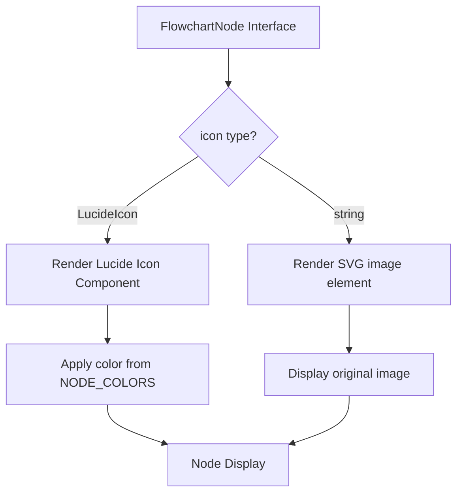

# Design Document

## Overview

This feature extends the flowchart node icon system to support both Lucide React icons and custom image paths. The implementation uses TypeScript union types for type safety and conditional rendering in SVG for display.

## Steering Document Alignment

### Technical Standards (tech.md)
- Uses TypeScript strict mode with proper type narrowing
- Follows existing React functional component patterns
- Uses SVG for rendering, consistent with existing flowchart implementation

### Project Structure (structure.md)
- Type definitions extended in `flowchartData.ts` (co-located with existing types)
- Component logic extended in `FlowchartNode.tsx` (existing component)
- Image assets placed in `public/` directory for Next.js static serving

## Code Reuse Analysis

### Existing Components to Leverage
- **FlowchartNode component**: Extended to support image icons via conditional rendering
- **NODE_DIMENSIONS**: Reused for sizing calculations
- **getIconPosition()**: Reused for positioning image icons identically to Lucide icons
- **NODE_COLORS**: Reused for node state styling (image icons ignore color tinting)

### Integration Points
- **SVG rendering**: Uses SVG `<image>` element for optimal scaling and integration
- **Next.js static assets**: Images served from `public/` directory via path string

## Architecture



## Components and Interfaces

### FlowchartNode Interface (Extended)
- **Purpose:** Define node data structure with flexible icon type
- **Changes:** `icon` property changed from `LucideIcon` to `LucideIcon | string`
- **File:** `src/components/flowchart/flowchartData.ts`

```typescript
export interface FlowchartNode {
  id: string;
  label: string;
  icon: LucideIcon | string;  // NEW: Support image paths
  type: 'actor' | 'action' | 'decision' | 'endpoint';
  position: { x: number; y: number };
}
```

### FlowchartNode Component (Extended)
- **Purpose:** Render nodes with either Lucide icons or custom images
- **Changes:** Added conditional rendering logic for icon type
- **Dependencies:** React, SVG rendering
- **Reuses:** Existing positioning, dimension, and color logic

```typescript
// Icon rendering logic
{isImageIcon ? (
  <image href={icon as string} width={20} height={20} x={0} y={0} />
) : (
  <IconComponent className="w-5 h-5" style={{ color: colors.icon }} />
)}
```

## Data Models

### Jenkins Node
```typescript
{
  id: 'jenkins',
  label: 'Jenkins CI',
  icon: '/jenkins.png',  // Image path (string)
  type: 'action',
  position: { x: 550, y: 350 },
}
```

### Jenkins Edge
```typescript
{
  id: 'e-jenkins',
  from: 'merge-request',
  to: 'jenkins',
  label: 'Trigger CI',
  type: 'forward',
}
```

## Error Handling

### Error Scenarios
1. **Image file not found**
   - **Handling:** Browser displays broken image placeholder; flowchart remains functional
   - **User Impact:** Empty icon area, no flowchart disruption

2. **Invalid icon type**
   - **Handling:** TypeScript compile-time error prevents invalid types
   - **User Impact:** None (caught at development time)

## Testing Strategy

### Unit Testing
- Test icon type detection (`isImageIcon` flag)
- Test conditional rendering logic
- Verify node rendering with both icon types

### Integration Testing
- Verify Jenkins node appears in flowchart
- Test edge connection from Merge Request to Jenkins
- Verify flowchart animation works with image icon nodes

### End-to-End Testing
- Navigate to `/cicd-workflow`
- Verify Jenkins node renders with correct image
- Test node click interaction and animation sequence