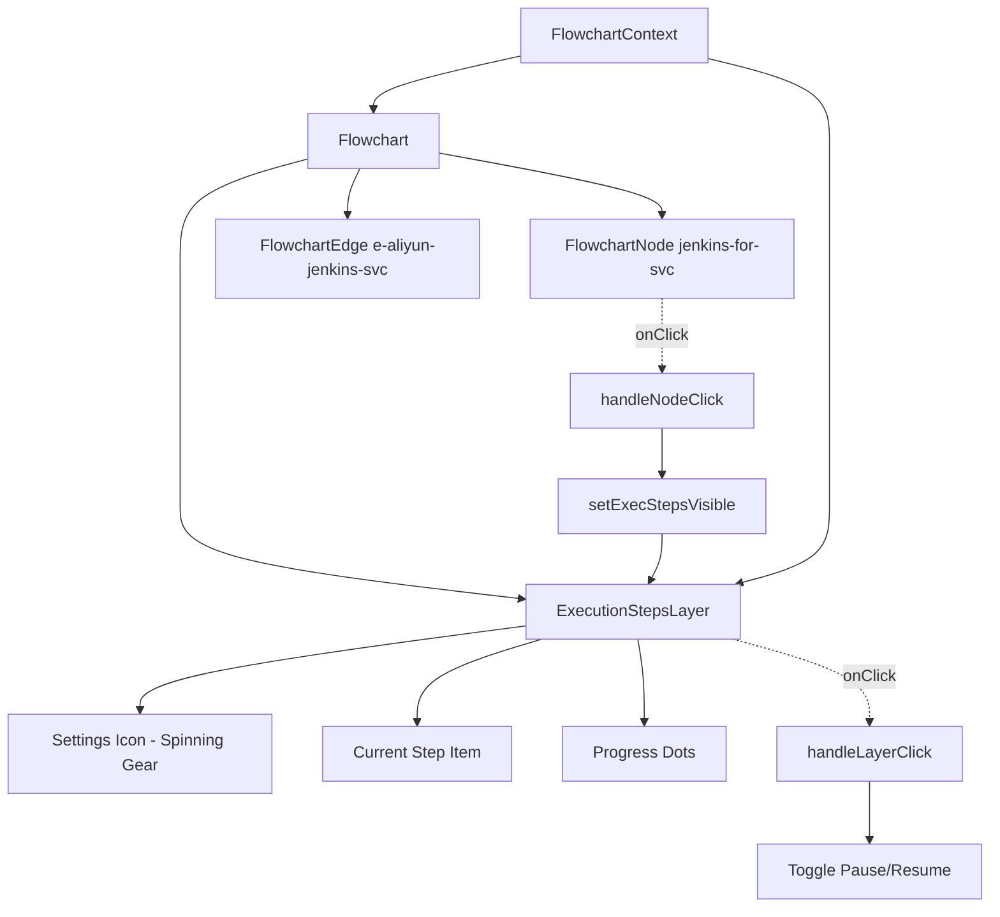

# Design Document

## Overview

The Execution Steps Layer is an interactive SVG overlay component that displays CI/CD pipeline steps above the `e-aliyun-jenkins-svc` edge in the flowchart. It features auto-scrolling items with fade animations, a spinning gear icon, click-to-pause functionality, and an ice-blue color theme. Triggered by clicking the `jenkins-for-svc` action node.

## Steering Document Alignment

### Technical Standards (tech.md)
- Uses React functional components with hooks for state management
- Follows existing TypeScript patterns with strict typing
- Uses Tailwind CSS for styling (via CSS classes defined in globals.css)
- Implements CSS animations following the existing flowchart animation patterns

### Project Structure (structure.md)
- Component files placed in `src/components/flowchart/`
- Data definitions added to `flowchartData.ts`
- Animation constants added to `FlowchartContext.tsx`

## Code Reuse Analysis

### Existing Components to Leverage
- **FlowchartContext.tsx**: Use `useFlowchart()` hook to access state; add new state fields for layer visibility and pause control
- **globals.css**: Extend existing animation keyframes pattern (`flowchart-node-pulse`, `flowchart-edge-draw`)
- **FlowchartNode.tsx**: Reference for accessibility patterns (`role`, `aria-label`, `tabIndex`)

### Integration Points
- **Flowchart.tsx**: Add the new `ExecutionStepsLayer` component to the SVG, conditionally rendered based on state
- **FlowchartContext.tsx**: Add `execStepsVisible`, `execStepsCurrentIndex`, `setExecStepsCurrentIndex`, and layer hiding logic
- **flowchartData.ts**: Add execution steps data structure
- **index.ts**: Export `ExecutionStepsLayer` component

## Architecture



### SVG Hierarchy Position
The `ExecutionStepsLayer` should be rendered after the edges but before the nodes in the SVG, so it appears behind nodes but above edges.

## Components and Interfaces

### ExecutionStepsLayer Component
- **Purpose:** Container component that renders the execution steps overlay with auto-scroll functionality, pause control, and spinning gear
- **File:** `src/components/flowchart/ExecutionStepsLayer.tsx`
- **Dependencies:** `useFlowchart()` hook, CSS animations from globals.css, `Settings` icon from Lucide
- **Reuses:** Animation timing constants pattern from FlowchartContext.tsx, accessibility patterns from FlowchartNode.tsx

### Internal State (in FlowchartContext)
```typescript
// Add to FlowchartContextValue
execStepsVisible: boolean;
execStepsCurrentIndex: number;
setExecStepsVisible: (visible: boolean) => void;
setExecStepsCurrentIndex: (index: number) => void;
resetExecStepsAnimation: () => void;
```

### Local State (in ExecutionStepsLayer)
```typescript
const [isPaused, setIsPaused] = useState(false);
```

## Data Models

### ExecutionStepItem
```typescript
interface ExecutionStepItem {
  id: string;
  label: string;
  icon: LucideIcon; // Direct Lucide icon component
}

// Defined in flowchartData.ts
const EXECUTION_STEPS: ExecutionStepItem[] = [
  { id: 'pull-code', label: 'Pull Code', icon: GitPullRequest },
  { id: 'unit-test', label: 'Unit Test', icon: TestTube },
  { id: 'scan', label: 'Scan', icon: Search },
  { id: 'build-image', label: 'Build Image', icon: Package },
  { id: 'push-image', label: 'Push Image', icon: Upload },
  { id: 'deploy', label: 'Deploy', icon: Rocket },
];
```

## Positioning

The layer will be positioned above the `e-aliyun-jenkins-svc` edge:
- **Edge from:** `jenkins-for-svc` at position `{ x: 300, y: 170 }`
- **Edge to:** `aliyun-cloud` at position `{ x: 50, y: 170 }`
- **Layer position:** Midpoint of the horizontal edge, offset upward

```typescript
// Position calculation in ExecutionStepsLayer.tsx
const LAYER = {
  WIDTH: 100,
  HEIGHT: 48,
  BORDER_RADIUS: 8,
};

const position = {
  x: (470) / 2 - LAYER.WIDTH / 2,
  y: 170 - 20,
};
```

## Visual Styling

### Layer Container (Ice-Blue Theme)
- **Size:** 100px width × 48px height
- **Background:** Light ice-blue (`#f0f9ff`)
- **Border:** 1.5px solid sky-400 (`#38bdf8`)
- **Border radius:** 8px
- **Shadow:** `drop-shadow(0 1px 3px rgba(56, 189, 248, 0.2))`

### Spinning Gear Icon
- **Icon:** Settings from Lucide
- **Size:** 24px
- **Color:** Sky-400 (`#38bdf8`)
- **Position:** Top center, partially outside the container
- **Animation:** Rotates 360° every 1 second (stops when paused or at last item)

### Item Text
- **Font size:** 13px
- **Font weight:** 500 (medium)
- **Color:** Sky-700 (`#0369a1`)
- **Icon size:** 16px, color Sky-500 (`#0ea5e9`)
- **Alignment:** Centered within container

### Progress Dots
- **Count:** 6 dots (one per step)
- **Size:** 4px diameter (r=2)
- **Active color:** Sky-400 (`#38bdf8`)
- **Inactive color:** Sky-200 (`#bae6fd`)
- **Position:** Bottom center of container

## Animation Specifications

### CSS Keyframes (globals.css)
```css
/* Layer fade in */
@keyframes exec-steps-fade-in {
  from { opacity: 0; }
  to { opacity: 1; }
}

/* Item fade in */
@keyframes exec-steps-item-fade-in {
  from { opacity: 0; transform: translateY(-4px); }
  to { opacity: 1; transform: translateY(0); }
}

/* Item fade out */
@keyframes exec-steps-item-fade-out {
  from { opacity: 1; transform: translateY(0); }
  to { opacity: 0; transform: translateY(4px); }
}

/* Gear spin */
@keyframes exec-steps-gear-spin {
  from { transform: rotate(0deg); }
  to { transform: rotate(360deg); }
}
```

### SVG animateTransform for Gear
```xml
<animateTransform
  attributeName="transform"
  type="rotate"
  from="0 12 12"
  to="360 12 12"
  dur="1s"
  repeatCount="indefinite"
/>
```

### Animation Timing Constants (FlowchartContext.tsx)
```typescript
export const ANIMATION_DURATIONS = {
  // ... existing
  EXEC_STEPS_LAYER_FADE: 300,
  EXEC_STEPS_ITEM_DISPLAY: 1000, // 1 second per item
  EXEC_STEPS_ITEM_TRANSITION: 300,
} as const;
```

## Click Handler Integration

### Modified startAnimation in FlowchartContext.tsx
```typescript
const startAnimation = useCallback((nodeId: NodeId) => {
  // ... existing logic

  // Hide ExecutionStepsLayer if clicking a predecessor of jenkins-for-svc
  const clickedIndex = getNodeIndex(nodeId);
  const jenkinsForSvcIndex = NODE_SEQUENCE.indexOf('jenkins-for-svc');
  if (clickedIndex < jenkinsForSvcIndex) {
    setExecStepsVisible(false);
    setExecStepsCurrentIndex(0);
  }

  // ... rest of function
}, []);
```

### Layer Click Handler in ExecutionStepsLayer.tsx
```typescript
const handleClick = () => {
  if (isAtLastItem) {
    // At last item: restart from beginning
    setExecStepsCurrentIndex(0);
    setIsPaused(false);
  } else {
    // Toggle pause/resume
    setIsPaused(!isPaused);
  }
};
```

## Visibility State Logic

| Action | execStepsVisible | isPaused | currentIndex |
|--------|------------------|----------|--------------|
| Click jenkins-for-svc (first time) | true | false | 0 |
| Click jenkins-for-svc (already visible) | true | false | 0 (reset) |
| Click predecessor node | false | - | 0 (reset) |
| Click successor node | unchanged | unchanged | unchanged |
| Click layer (scrolling) | unchanged | toggled | unchanged |
| Click layer (at last item) | unchanged | false | 0 (restart) |

## Accessibility

The ExecutionStepsLayer will include:
- `role="button"` on the container (clickable element)
- `aria-label` with current state: `CI/CD Pipeline Steps: {currentItem}{Paused?}`
- `aria-live="polite"` for item changes
- `aria-atomic="true"` to announce only the current item
- `tabIndex={0}` for keyboard access
- `onKeyDown` handler for Enter/Space to toggle pause
- `outline: 'none'` style to remove focus ring

## Error Handling

### Error Scenarios
1. **Scenario:** Node positions undefined or edge missing
   - **Handling:** Return null from component (no render)
   - **User Impact:** Layer simply doesn't appear, flowchart remains functional

2. **Scenario:** Animation timer fails to clear on unmount
   - **Handling:** useEffect cleanup function clears timer
   - **User Impact:** No memory leak, proper cleanup

3. **Scenario:** Node animation already in progress
   - **Handling:** Execution steps animation runs independently
   - **User Impact:** Both animations can occur simultaneously

## Testing Strategy

### Unit Testing
- Test ExecutionStepsLayer renders when `execStepsVisible` is true
- Test that layer is hidden when `execStepsVisible` is false
- Test auto-scroll timer advances `execStepsCurrentIndex` correctly
- Test that timer stops at last item (index 5)
- Test `resetExecStepsAnimation` resets to index 0
- Test pause/resume functionality on click
- Test restart from beginning when clicking at last item

### Integration Testing
- Test that clicking `jenkins-for-svc` node sets `execStepsVisible` to true
- Test that re-clicking `jenkins-for-svc` resets animation to index 0
- Test that clicking predecessor nodes hides the layer
- Test that clicking successor nodes keeps the layer visible
- Test fade animations apply correct CSS classes
- Test gear spinning stops when paused or at last item

### End-to-End Testing
- Test complete user flow: load flowchart → click Jenkins node → watch scroll animation → pause → resume → verify last item stays visible → click to restart