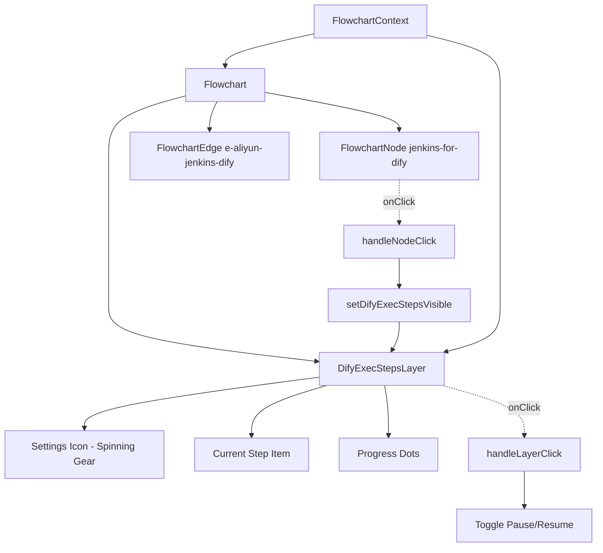

# Design Document

## Overview

The Dify Execution Steps Layer is an interactive SVG overlay component that displays AI workflow deployment steps above the `e-aliyun-jenkins-dify` edge in the flowchart. It features auto-scrolling items with fade animations, a spinning gear icon, click-to-pause functionality, and an ice-blue color theme. Triggered by clicking the `jenkins-for-dify` action node.

## Steering Document Alignment

### Technical Standards (tech.md)
- Uses React functional components with hooks for state management
- Follows existing TypeScript patterns with strict typing
- Uses Tailwind CSS for styling (via CSS classes defined in globals.css)
- Implements CSS animations following the existing flowchart animation patterns

### Project Structure (structure.md)
- Component files placed in `src/components/flowchart/`
- Data definitions added to `flowchartData.ts`
- Animation constants reuse existing values from `FlowchartContext.tsx`

## Code Reuse Analysis

### Existing Components to Leverage
- **ExecutionStepsLayer.tsx**: Reuse as template for the new `DifyExecStepsLayer.tsx` component with adapted positioning and data
- **FlowchartContext.tsx**: Add new state fields for Dify layer visibility and pause control following the same pattern as `execStepsVisible`
- **globals.css**: Reuse existing animation keyframes (`exec-steps-fade-in`, `exec-steps-item-fade-in`)
- **FlowchartNode.tsx**: Reference for accessibility patterns (`role`, `aria-label`, `tabIndex`)

### Integration Points
- **Flowchart.tsx**: Add the new `DifyExecStepsLayer` component to the SVG, conditionally rendered based on state
- **FlowchartContext.tsx**: Add `difyExecStepsVisible`, `difyExecStepsCurrentIndex`, `setDifyExecStepsVisible`, `setDifyExecStepsCurrentIndex`, `resetDifyExecStepsAnimation`
- **flowchartData.ts**: Add `DIFY_EXECUTION_STEPS` data structure
- **index.ts**: Export `DifyExecStepsLayer` component

## Architecture



### SVG Hierarchy Position
The `DifyExecStepsLayer` should be rendered after the edges but before the nodes in the SVG, so it appears behind nodes but above edges (same as existing `ExecutionStepsLayer`).

## Components and Interfaces

### DifyExecStepsLayer Component
- **Purpose:** Container component that renders the Dify deployment steps overlay with auto-scroll functionality, pause control, and spinning gear
- **File:** `src/components/flowchart/DifyExecStepsLayer.tsx`
- **Dependencies:** `useFlowchart()` hook, CSS animations from globals.css, `Settings` icon from Lucide
- **Reuses:** Animation timing constants from FlowchartContext.tsx, accessibility patterns from FlowchartNode.tsx

### Internal State (in FlowchartContext)
```typescript
// Add to FlowchartContextValue
difyExecStepsVisible: boolean;
difyExecStepsCurrentIndex: number;
setDifyExecStepsVisible: (visible: boolean) => void;
setDifyExecStepsCurrentIndex: (index: number) => void;
resetDifyExecStepsAnimation: () => void;
```

### Local State (in DifyExecStepsLayer)
```typescript
const [isPaused, setIsPaused] = useState(false);
```

## Data Models

### DifyExecutionStepItem
```typescript
interface DifyExecutionStepItem {
  id: string;
  label: string;
  icon: LucideIcon; // Direct Lucide icon component
}

// Defined in flowchartData.ts
const DIFY_EXECUTION_STEPS: DifyExecutionStepItem[] = [
  { id: 'pull-dsl', label: 'Pull DSL', icon: Download },           // Download for pulling
  { id: 'login-dify', label: 'Login Dify', icon: LogIn },          // LogIn for authentication
  { id: 'deploy-workflow', label: 'Deploy', icon: Rocket }, // Rocket for deployment
  { id: 'verify', label: 'Verify', icon: CheckCircle },            // CheckCircle for verification
];
```

## Positioning

The layer will be positioned above the `e-aliyun-jenkins-dify` edge:
- **Edge from:** `jenkins-for-dify` at position `{ x: 550, y: 320 }`
- **Edge to:** `dify` at position `{ x: 300, y: 320 }`
- **Layer position:** Midpoint of the horizontal edge, offset upward

```typescript
// Position calculation in DifyExecStepsLayer.tsx
const LAYER = {
  WIDTH: 100,
  HEIGHT: 48,
  BORDER_RADIUS: 8,
};

const position = {
  x: (550 + 300) / 2 - LAYER.WIDTH / 2, // = 375
  y: 320 - 20, // 20px above the edge = 300
};
```

## Visual Styling

### Layer Container (Ice-Blue Theme - Same as Existing)
- **Size:** 100px width × 48px height
- **Background:** Light ice-blue (`#f0f9ff`)
- **Border:** 1.5px solid sky-400 (`#38bdf8`)
- **Border radius:** 8px
- **Shadow:** `drop-shadow(0 1px 3px rgba(56, 189, 248, 0.2))`

### Spinning Gear Icon
- **Icon:** Settings from Lucide
- **Size:** 24px
- **Color:** Sky-400 (`#38bdf8`)
- **Position:** Top center, partially outside the container
- **Animation:** Rotates 360° every 1 second (stops when paused or at last item)

### Item Text
- **Font size:** 13px
- **Font weight:** 500 (medium)
- **Color:** Sky-700 (`#0369a1`)
- **Icon size:** 16px, color Sky-500 (`#0ea5e9`)
- **Alignment:** Centered within container

### Progress Dots
- **Count:** 4 dots (one per step)
- **Size:** 4px diameter (r=2)
- **Active color:** Sky-400 (`#38bdf8`)
- **Inactive color:** Sky-200 (`#bae6fd`)
- **Position:** Bottom center of container

## Animation Specifications

### CSS Keyframes (Reuse Existing from globals.css)
```css
/* Layer fade in - reuse existing */
.exec-steps-layer-fade-in {
  animation: exec-steps-fade-in 0.3s ease-out forwards;
}

/* Item fade in - reuse existing */
.exec-steps-item-fade-in {
  animation: exec-steps-item-fade-in 0.3s ease-out forwards;
}
```

### SVG animateTransform for Gear (Same as Existing)
```xml
<animateTransform
  attributeName="transform"
  type="rotate"
  from="0 12 12"
  to="360 12 12"
  dur="1s"
  repeatCount="indefinite"
/>
```

### Animation Timing Constants (Reuse Existing from FlowchartContext.tsx)
```typescript
// Reuse existing constants
ANIMATION_DURATIONS.EXEC_STEPS_LAYER_FADE: 300
ANIMATION_DURATIONS.EXEC_STEPS_ITEM_DISPLAY: 1000
ANIMATION_DURATIONS.EXEC_STEPS_ITEM_TRANSITION: 300
```

## Click Handler Integration

### Modified startAnimation in FlowchartContext.tsx
```typescript
const startAnimation = useCallback((nodeId: NodeId) => {
  // ... existing logic

  // Hide DifyExecStepsLayer if clicking a predecessor of jenkins-for-dify
  const clickedIndex = getNodeIndex(nodeId);
  const jenkinsForDifyIndex = NODE_SEQUENCE.indexOf('jenkins-for-dify');
  if (clickedIndex < jenkinsForDifyIndex) {
    setDifyExecStepsVisible(false);
    setDifyExecStepsCurrentIndex(0);
  }

  // ... rest of function
}, []);
```

### Layer Click Handler in DifyExecStepsLayer.tsx
```typescript
const handleClick = () => {
  if (isAtLastItem) {
    // At last item: restart from beginning
    setDifyExecStepsCurrentIndex(0);
    setIsPaused(false);
  } else {
    // Toggle pause/resume
    setIsPaused(!isPaused);
  }
};
```

## Visibility State Logic

| Action | difyExecStepsVisible | isPaused | currentIndex |
|--------|---------------------|----------|--------------|
| Click jenkins-for-dify (first time) | true | false | 0 |
| Click jenkins-for-dify (already visible) | true | false | 0 (reset) |
| Click predecessor node | false | - | 0 (reset) |
| Click successor node | unchanged | unchanged | unchanged |
| Click layer (scrolling) | unchanged | toggled | unchanged |
| Click layer (at last item) | unchanged | false | 0 (restart) |

## Accessibility

The DifyExecStepsLayer will include:
- `role="button"` on the container (clickable element)
- `aria-label` with current state: `AI Workflow Deployment Steps: {currentItem}{Paused?}`
- `aria-live="polite"` for item changes
- `aria-atomic="true"` to announce only the current item
- `tabIndex={0}` for keyboard access
- `onKeyDown` handler for Enter/Space to toggle pause
- `outline: 'none'` style to remove focus ring

## Error Handling

### Error Scenarios
1. **Scenario:** Node positions undefined or edge missing
   - **Handling:** Return null from component (no render)
   - **User Impact:** Layer simply doesn't appear, flowchart remains functional

2. **Scenario:** Animation timer fails to clear on unmount
   - **Handling:** useEffect cleanup function clears timer
   - **User Impact:** No memory leak, proper cleanup

3. **Scenario:** Node animation already in progress
   - **Handling:** Dify execution steps animation runs independently
   - **User Impact:** Both animations can occur simultaneously

## Testing Strategy

### Unit Testing
- Test DifyExecStepsLayer renders when `difyExecStepsVisible` is true
- Test that layer is hidden when `difyExecStepsVisible` is false
- Test auto-scroll timer advances `difyExecStepsCurrentIndex` correctly
- Test that timer stops at last item (index 3)
- Test `resetDifyExecStepsAnimation` resets to index 0
- Test pause/resume functionality on click

### Integration Testing
- Test that clicking `jenkins-for-dify` node sets `difyExecStepsVisible` to true
- Test that re-clicking `jenkins-for-dify` resets animation to index 0
- Test that clicking predecessor nodes hides the layer
- Test that clicking successor nodes keeps the layer visible
- Test fade animations apply correct CSS classes
- Test gear spinning stops when paused or at last item

### End-to-End Testing
- Test complete user flow: load flowchart → click Jenkins-for-Dify node → watch scroll animation → pause → resume → verify last item stays visible → click to restart