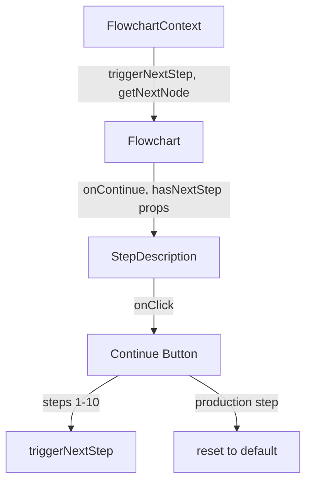

# Design Document

## Overview

Add a Continue button to the StepDescription component that appears on non-default steps. The button uses the existing navigation infrastructure from FlowchartContext.

## Steering Document Alignment

### Technical Standards (tech.md)
- Uses Lucide React icons (ArrowRightCircleIcon)
- Uses existing React Context pattern for state management
- Follows Tailwind CSS styling conventions
- Uses Framer Motion hover effects via CSS transitions

### Project Structure (structure.md)
- Component modification: `src/components/flowchart/StepDescription.tsx`
- Parent component update: `src/components/flowchart/Flowchart.tsx`
- Follows existing component architecture with props interface

## Code Reuse Analysis

### Existing Components to Leverage
- **`triggerNextStep()`** in FlowchartContext: Used to advance to next step
- **`getNextNode()`** in FlowchartContext: Used to determine if there's a next step
- **`ArrowRightCircleIcon`** from lucide-react: Icon for the Continue button
- **`step.accent`**: Color styling from existing step configuration

### Integration Points
- StepDescription receives `onContinue` and `hasNextStep` props from Flowchart
- Flowchart uses `useFlowchart()` hook to access context methods

## Architecture

## Components and Interfaces

### StepDescription Props Extension
- **Purpose:** Add navigation capability to step title area
- **New Props:**
  - `onContinue?: () => void` - Callback when Continue button is clicked
  - `hasNextStep?: boolean` - Whether there's a next step in sequence
- **Dependencies:** None (receives callbacks from parent)
- **Reuses:** Existing step data, accent colors, Lucide icons

### Continue Button Component (inline)
- **Purpose:** Provide navigation action on step title
- **Visual:** ArrowRightCircleIcon with step accent color
- **Behavior:**
  - Hover: scale(1.1) transformation
  - Tooltip: "Continue to next step" or "Return to start"
- **Reuses:** Lucide React icons, existing button styling patterns

## Data Models

No new data models required. Uses existing:
- `NodeId` type from FlowchartContext
- `StepInfo` interface from StepDescription
- `NODE_SEQUENCE` array for step ordering

## Error Handling

### Error Scenarios
1. **Scenario:** Continue button clicked during animation
   - **Handling:** `triggerNextStep()` checks `isAnimatingRef.current` and returns early
   - **User Impact:** No action taken, prevents race conditions

2. **Scenario:** Continue button clicked on last step
   - **Handling:** Special case in `onContinue` callback resets to default
   - **User Impact:** Returns to initial state, marking production as completed

## Testing Strategy

### Unit Testing
- Verify Continue button renders on non-default steps
- Verify Continue button does not render on default step
- Verify correct tooltip text based on step position

### Integration Testing
- Verify clicking Continue advances to next step
- Verify clicking Continue on production returns to default
- Verify animation state is respected

### End-to-End Testing
- Walk through entire workflow using Continue button
- Verify final Continue button returns to start