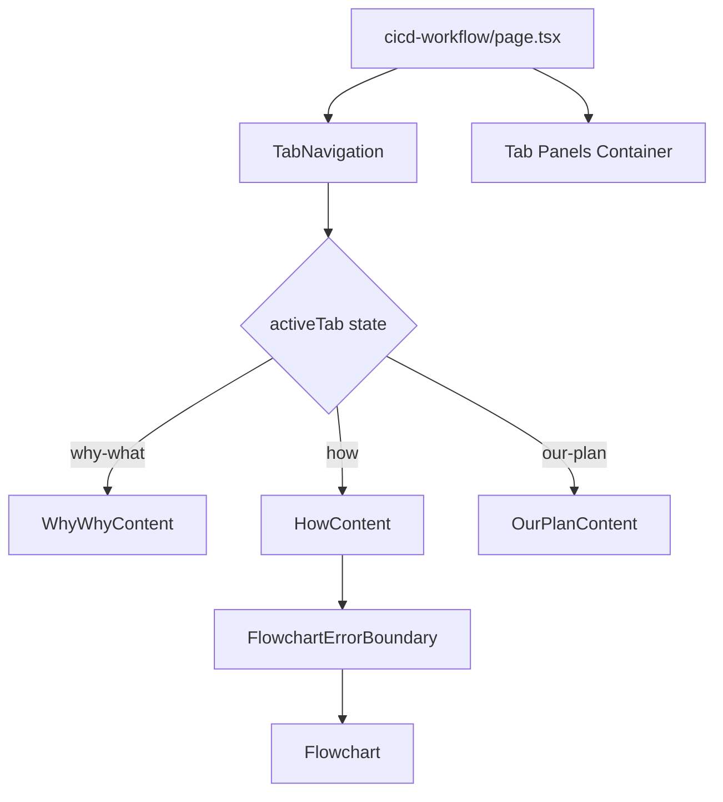

# Design Document

## Overview

Add a tab navigation system to the CI/CD Workflow page using React state management. The existing Flowchart component will be wrapped in a "How" tab, while two new placeholder tabs ("Why & What" and "Our Plan") will provide structure for future content.

## Steering Document Alignment

### Technical Standards (tech.md)

- Uses React functional components with TypeScript
- Follows Tailwind CSS styling conventions
- Uses Lucide React icons if needed
- Follows path alias convention (`@/*` maps to `./src/*`)

### Project Structure (structure.md)

- Components organized by feature: `src/components/tabs/` for reusable Tab components
- Page-specific content in `src/components/cicd-workflow/`
- Page entry point: `src/app/cicd-workflow/page.tsx`

## Code Reuse Analysis

### Existing Components to Leverage

- **`Flowchart`**: Existing interactive SVG flowchart component - will be wrapped in HowContent
- **`FlowchartErrorBoundary`**: Error boundary wrapper - should wrap Flowchart in HowContent
- **`BRAND.colors.primary`** from `src/lib/constants.ts`: Yellow (#EAB308) for active tab accent

### Integration Points

- **`src/app/cicd-workflow/page.tsx`**: Main page that will integrate tab navigation
- **`src/lib/constants.ts`**: Brand colors for consistent styling

## Architecture



## Layout Strategy

### Preventing Tab Switching Jitter

To prevent layout jitter when switching between tabs:

1. **Absolute Positioning**: All tab panels use `absolute inset-0` positioning, stacking them at the same position
2. **Visibility Control**: Use `visibility: visible/hidden` instead of `display: none` to keep all content in DOM
3. **Dynamic Height**: Container height is calculated dynamically based on active tab content using `useRef` and `useEffect`
4. **No Animations**: Framer Motion animations were removed to prevent layout reflow

```typescript
// Container with dynamic height
<div ref={containerRef} className="relative" style={{ height: height || 'auto' }}>
  <div className="absolute inset-0" style={{ visibility: activeTab === 'why-what' ? 'visible' : 'hidden' }}>
    <WhyWhyContent />
  </div>
  {/* ... other tabs */}
</div>
```

## Components and Interfaces

### TabNavigation

- **Purpose:** Render tab buttons with active state styling
- **Props:**
  - `tabs: TabItem[]` - Array of tab configurations
  - `activeTab: string` - Currently active tab ID
  - `onTabChange: (tabId: string) => void` - Tab change callback
- **Dependencies:** None
- **Reuses:** Brand colors from constants

```typescript
interface TabItem {
  id: string;
  label: string;
}

interface TabNavigationProps {
  tabs: TabItem[];
  activeTab: string;
  onTabChange: (tabId: string) => void;
}
```

### WhyWhyContent

- **Purpose:** Placeholder content for "Why & What" tab
- **Content:** Heading and placeholder text explaining CI/CD purpose
- **Dependencies:** None

### HowContent

- **Purpose:** Wrapper for existing Flowchart component
- **Content:** FlowchartErrorBoundary wrapping Flowchart
- **Dependencies:** Flowchart, FlowchartErrorBoundary
- **Reuses:** Existing flowchart components unchanged

### OurPlanContent

- **Purpose:** Placeholder content for "Our Plan" tab
- **Content:** Heading and placeholder text for implementation roadmap
- **Dependencies:** None

## Data Models

### Tab State

```typescript
type TabId = 'why-what' | 'how' | 'our-plan';

interface TabConfig {
  id: TabId;
  label: string;
}

const TABS: TabConfig[] = [
  { id: 'why-what', label: 'Why' },
  { id: 'how', label: 'How' },
  { id: 'our-plan', label: 'Our Plan' },
];
```

## File Structure

```
src/
├── app/
│   ├── cicd-workflow/
│   │   └── page.tsx           # Modified: Add tab structure with dynamic height
│   └── globals.css            # Modified: Add scrollbar-hide utility
├── components/
│   ├── tabs/
│   │   ├── TabNavigation.tsx  # New: Reusable tab navigation
│   │   └── TabContent.tsx     # New: Content wrapper (simplified)
│   ├── cicd-workflow/
│   │   ├── WhyWhyContent.tsx  # New: Why & What placeholder
│   │   ├── HowContent.tsx     # New: Flowchart wrapper
│   │   └── OurPlanContent.tsx # New: Our Plan placeholder
│   └── flowchart/
│       └── Flowchart.tsx      # Modified: Remove transition-all, redundant max-w
└── lib/
    └── constants.ts           # Existing: Brand colors
```

## Styling Specifications

### Tab Navigation

- **Container:** `flex justify-center gap-1 border-b border-gray-200 mb-6 overflow-x-auto scrollbar-hide`
- **Tab Button (inactive):** `px-4 py-2 text-sm text-gray-500 font-medium border-b-2 border-transparent transition-colors hover:text-gray-700`
- **Tab Button (active):** `px-4 py-2 text-sm text-gray-900 font-medium border-b-2` with yellow border color from brand
- **Mobile:** `overflow-x-auto scrollbar-hide` for horizontal scrolling

### Tab Content

- **Container:** `relative` with dynamic height
- **Tab Panel:** `absolute inset-0` with visibility control

### Content Sections

- **Heading:** `text-2xl font-bold text-slate-800 mb-4 text-center`
- **Placeholder text:** `text-slate-500 text-center max-w-2xl px-4 mx-auto`

## Error Handling

### Error Scenarios

1. **Scenario:** Flowchart fails to render in How tab
   - **Handling:** FlowchartErrorBoundary catches error and displays fallback
   - **User Impact:** Error message shown, other tabs remain functional

2. **Scenario:** Tab state becomes inconsistent
   - **Handling:** Default to 'how' tab if invalid state detected
   - **User Impact:** Page remains usable with default view

## Testing Strategy

### Unit Testing

- Verify TabNavigation renders all tabs
- Verify active tab has correct styling
- Verify tab click triggers onTabChange callback

### Integration Testing

- Verify tab switching updates displayed content
- Verify Flowchart remains interactive in How tab
- Verify Flowchart state persists when switching tabs (all tabs remain in DOM)

### End-to-End Testing

- Navigate to CI/CD Workflow page
- Verify default tab is "How"
- Switch between all tabs and verify content changes
- Verify no layout jitter when switching tabs
- Test on mobile viewport for horizontal scrolling