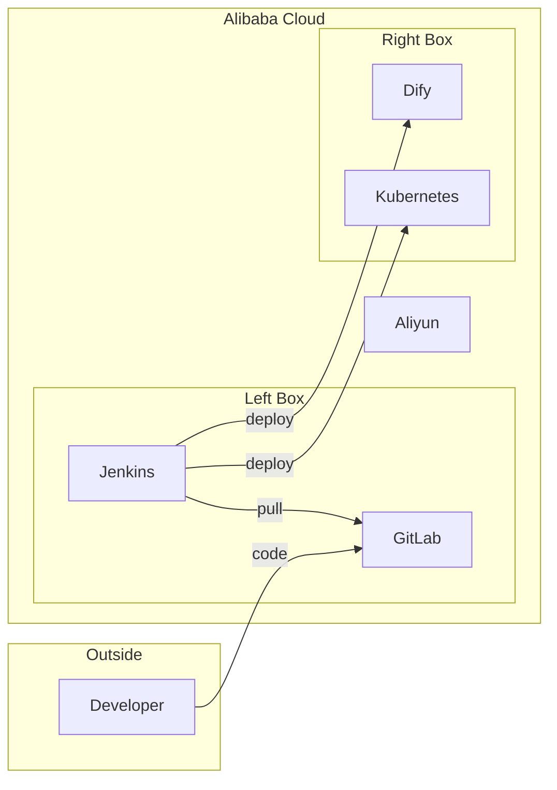

# Design: Why & What Architecture Diagram

## Overview

This document describes the technical design for adding an architecture diagram to the WhyWhatContent component.

## Architecture

### Component Structure

```
WhyWhatContent.tsx
├── Header Section (existing)
│   ├── Badge Image
│   └── H2 Title
├── Expandable Items (existing)
│   ├── Item 1: Faster Time-to-Market
│   ├── Item 2: Higher Reliability & Security
│   └── Item 3: Greater Team Autonomy & Agility
└── NEW: Architecture Section (collapsible)
    ├── Button with H3 Title: "It'll look like..."
    ├── Expand/Collapse Icon (+/-)
    └── ArchitectureDiagram SVG Component (wrapped in AnimatePresence)
```

### Diagram Layout

```
┌─────────────────────────────────────────────────────────────────┐
│                                                                 │
│  ┌──────┐                                                       │
│  │ Dev  │                                                       │
│  │User  │                                                       │
│  └──┬───┘                                                       │
│     │                                                           │
│     └───────────┐ code                                          │
│                 ▼                                               │
│  ┌─────────────────────────────────────────────────────────┐   │
│  │                   Alibaba Cloud                     [☁] │   │
│  │  ┌ ─ ─ ─ ─ ─ ─ ─ ┐    ┌ ─ ─ ─ ─ ─ ─ ─ ┐               │   │
│  │       GitLab    │    │    Dify      │               │   │
│  │  │   [icon]      │    │   [icon]     │               │   │
│  │                 │    │              │               │   │
│  │  │      ▲        │    │      ▲       │               │   │
│  │       │ pull     │    │      │deploy │               │   │
│  │  │      │        │    │      │       │               │   │
│  │     Jenkins     │────┼──────┼───────│               │   │
│  │  │   [icon]      │    │              │               │   │
│  │       │          │    │   Kubernetes │               │   │
│  │  │      └────────┼────┼──────►       │               │   │
│  │                 │    │   [icon]      │               │   │
│  │  └ ─ ─ ─ ─ ─ ─ ─ ┘    └ ─ ─ ─ ─ ─ ─ ─ ┘               │   │
│  │                                                          │   │
│  └──────────────────────────────────────────────────────────┘   │
│                                                                 │
└─────────────────────────────────────────────────────────────────┘
```

## Component Design

### State Management

```tsx
const [isDiagramExpanded, setIsDiagramExpanded] = useState(true);
```

### SVG Structure

```tsx
{/* Button with expand/collapse */}
<button onClick={() => setIsDiagramExpanded(!isDiagramExpanded)}>
  <h3>It'll look like...</h3>
  <Plus/Minus icon />
</button>

<AnimatePresence>
  {isDiagramExpanded && (
    <motion.div>
      <svg viewBox="0 0 500 260">
        <defs>{/* Arrow markers */}</defs>

        {/* Cloud region boundary */}
        <rect className="cloud-region" />

        {/* Developer node (outside cloud) - uses User icon from lucide-react */}
        <g className="developer-node">
          <User size={24} />
          <text>Developer</text>
        </g>

        {/* Left dashed box: GitLab + Jenkins */}
        <rect strokeDasharray="4 4" />

        {/* GitLab node */}
        <g className="gitlab-node">
          <image href="/gitlab.png" />
          <text>GitLab</text>
        </g>

        {/* Jenkins node */}
        <g className="jenkins-node">
          <image href="/jenkins-color.png" />
          <text>Jenkins</text>
        </g>

        {/* Right dashed box: Dify + Kubernetes */}
        <rect strokeDasharray="4 4" />

        {/* Dify node */}
        <g className="dify-node">
          <image href="/dify.svg" />
          <text>Dify</text>
        </g>

        {/* Kubernetes node */}
        <g className="k8s-node">
          <image href="/kubernetes.png" />
          <text>Kubernetes</text>
        </g>

        {/* Animated connection lines (straight) */}
        <path d="M 110 70 L 160 70" />       {/* Developer → GitLab */}
        <path d="M 190 160 L 190 100" />     {/* Jenkins → GitLab */}
        <path d="M 220 175 L 300 70" />      {/* Jenkins → Dify (diagonal) */}
        <path d="M 220 190 L 300 190" />     {/* Jenkins → Kubernetes */}

        {/* Dashed boxes (rendered after lines) */}
        <rect strokeDasharray="4 4" />       {/* GitLab+Jenkins box */}
        <rect strokeDasharray="4 4" />       {/* Dify+Kubernetes box */}

        {/* Aliyun icon */}
        <image href="/aliyun.jpg" />
      </svg>
    </motion.div>
  )}
</AnimatePresence>
```

### Animated Edge Pattern

Reuse the animation CSS from Flowchart:

```css
.flowchart-edge-flowing {
  animation: flowDash 1s linear infinite;
}

@keyframes flowDash {
  from { stroke-dashoffset: 20; }
  to { stroke-dashoffset: 0; }
}
```

## Data Model

### Node Positions (SVG coordinates)

| Node | X | Y | Icon |
|------|---|---|------|
| Developer | 30 | 40 | User (lucide-react) |
| GitLab | 160 | 40 | /gitlab.png |
| Jenkins | 160 | 160 | /jenkins-color.png |
| Dify | 300 | 40 | /dify.svg |
| Kubernetes | 300 | 160 | /kubernetes.png |
| Aliyun | 380 | 205 | /aliyun.jpg |

### Edge Paths (Straight Lines)

| From | To | Path | Type |
|------|-----|------|------|
| Developer | GitLab | `M 110 70 L 160 70` | Horizontal |
| Jenkins | GitLab | `M 190 160 L 190 100` | Vertical |
| Jenkins | Dify | `M 220 175 L 300 70` | Diagonal |
| Jenkins | Kubernetes | `M 220 190 L 300 190` | Horizontal |

### Dashed Boxes

| Box | X | Y | Width | Height |
|-----|---|---|-------|--------|
| GitLab+Jenkins | 150 | 30 | 80 | 200 |
| Dify+Kubernetes | 290 | 30 | 80 | 200 |

## Styling

### Color Scheme

| Element | Color | Tailwind |
|---------|-------|----------|
| Cloud region stroke | #e2e8f0 | gray-200 |
| Cloud region fill | #f8fafc | slate-50 |
| Edge animated | #38bdf8 | sky-400 |
| Node text | #64748b | slate-500 |
| Dashed box stroke | #cbd5e1 | slate-300 |

## Mermaid Diagram



## Files Modified

| File | Changes |
|------|---------|
| `src/components/cicd-workflow/WhyWhatContent.tsx` | Added isDiagramExpanded state, collapsible architecture diagram section with SVG |

## Implementation Notes

1. **Expand/collapse**: Uses Framer Motion AnimatePresence for smooth animation
2. **Straight lines**: All connection lines are straight (no curves)
3. **Dashed boxes**: Rendered after connection lines so they appear on top
4. **Developer icon**: Uses User icon from lucide-react (not an image file)
5. **Responsive sizing**: Uses viewBox and `w-full h-auto` for responsive scaling

## Verification

1. Run `npm run dev` and navigate to CI/CD Workflow page
2. Click "Why & What" tab
3. Verify the architecture diagram section has expand/collapse button
4. Verify clicking the button toggles the diagram visibility
5. Verify all icons and labels are visible when expanded
6. Verify animated lines are flowing
7. Verify dashed boxes group the nodes correctly
8. Test responsive scaling by resizing browser window