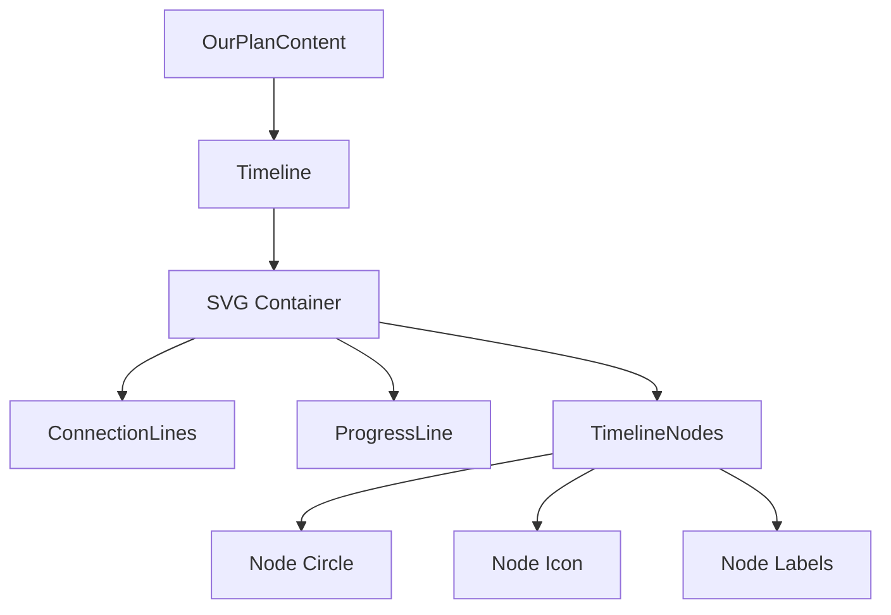
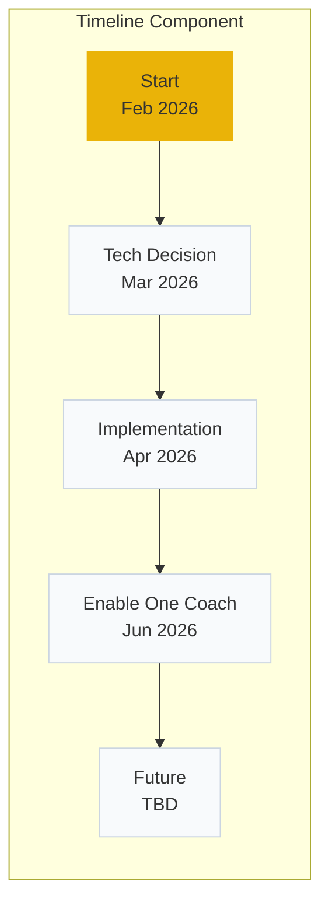

# Design: Our Plan Timeline

## Overview

This document describes the technical design for an interactive timeline component in the OurPlanContent tab. The timeline displays 5 project milestones with a "metro arrival" animation effect when users click nodes to visualize progress.

## Steering Document Alignment

### Technical Standards (tech.md)
- Uses Framer Motion for animations (consistent with existing Flowchart and WhyWhatContent components)
- Uses lucide-react for icons (consistent with site-wide icon usage)
- TypeScript strict mode with proper type definitions
- Tailwind CSS for styling with yellow brand theme (#EAB308)

### Project Structure (structure.md)
- Component placed in `src/components/cicd-workflow/Timeline.tsx`
- Follows existing component patterns in the cicd-workflow folder
- Integrates with existing tab structure

## Code Reuse Analysis

### Existing Components to Leverage
- **Framer Motion patterns**: `WhyWhatContent.tsx` (AnimatePresence, motion.div), `StepDescription.tsx` (opacity/scale animations)
- **Icon patterns**: `FlowchartNode.tsx` (icon rendering inside SVG), `Sidebar.tsx` (icon mapping)
- **Animation timing**: `FlowchartContext.tsx` (ANIMATION_DURATIONS constants)

### Integration Points
- **OurPlanContent.tsx**: Parent component where Timeline will be rendered
- **TabNavigation**: Already handles tab switching, Timeline just needs to render inside OurPlanContent
- **BRAND.colors.primary**: Yellow color constant from `src/lib/constants.ts`

## Architecture

### Component Structure

```
OurPlanContent.tsx
├── Header Section (existing)
│   ├── H2 Title: "Our Plan"
│   └── Description paragraph
└── Timeline Component (new)
    ├── SVG Container with viewBox
    │   ├── Connection Lines (gray dashed base)
    │   ├── Progress Lines (yellow animated overlay)
    │   └── Timeline Nodes (clickable circles with icons)
    └── Labels (title and date below each node)
```

### Component Hierarchy



## Components and Interfaces

### TimelineData Interface

```typescript
interface TimelineNode {
  id: string;
  title: string;
  date: string;
  icon: React.ComponentType<{ className?: string; size?: number }>;
}

interface TimelineProps {
  nodes: TimelineNode[];
  className?: string;
}
```

### Timeline Component
- **Purpose:** Main container managing timeline state and layout
- **Interfaces:** `Timeline(props: TimelineProps)`
- **Dependencies:** Framer Motion, lucide-react icons
- **State:**
  - `selectedNodeIndex: number | null` - Currently selected node for progress animation
  - `isAnimating: boolean` - Prevents clicks during animation

### TimelineNode Component
- **Purpose:** Renders individual milestone node with icon and labels
- **Interfaces:** `TimelineNode({ node, index, isSelected, onClick, position })`
- **Dependencies:** lucide-react icon component
- **Reuses:** Icon rendering pattern from `FlowchartNode.tsx`

### ConnectionLines Component
- **Purpose:** Renders gray dashed base lines between nodes
- **Interfaces:** `ConnectionLines({ nodePositions })`
- **Dependencies:** None (pure SVG)
- **Reuses:** SVG path patterns from `WhyWhatContent.tsx` architecture diagram

### ProgressLine Component
- **Purpose:** Animated yellow line showing progress from start to selected node
- **Interfaces:** `ProgressLine({ nodePositions, selectedIndex, isAnimating })`
- **Dependencies:** Framer Motion for stroke animation
- **Reuses:** stroke-dasharray animation pattern from `FlowchartEdge.tsx`

## Data Models

### Timeline Nodes Data

```typescript
const TIMELINE_NODES: TimelineNode[] = [
  { id: 'start', title: 'Start', date: 'Feb 2026', icon: Flag },
  { id: 'tech-decision', title: 'Tech Decision', date: 'Mar 2026', icon: Milestone },
  { id: 'implementation', title: 'Implementation', date: 'Apr 2026', icon: Pickaxe },
  { id: 'enable-coach', title: 'Enable One Coach', date: 'Jun 2026', icon: Rocket },
  { id: 'future', title: 'More products', date: 'Future', icon: SendHorizonal },
];
```

### Node Position Calculation

```typescript
interface NodePosition {
  x: number;  // SVG x coordinate
  y: number;  // SVG y coordinate
  row: number; // Row index for snake layout
  col: number; // Column index
}

// Snake layout: odd rows left-to-right, even rows right-to-left
function calculatePositions(
  nodeCount: number,
  containerWidth: number,
  nodeSpacing: number = 120,
  rowSpacing: number = 80
): NodePosition[] {
  const positions: NodePosition[] = [];
  const nodesPerRow = containerWidth >= 640 ? nodeCount : 3; // 5 for desktop, 3 for mobile

  for (let i = 0; i < nodeCount; i++) {
    const row = Math.floor(i / nodesPerRow);
    const col = i % nodesPerRow;
    const isReversedRow = row % 2 === 1;

    // Calculate x position (reverse for even rows in snake layout)
    const actualCol = isReversedRow ? (nodesPerRow - 1 - col) : col;
    const x = 60 + actualCol * nodeSpacing; // 60px left padding

    // Calculate y position
    const y = 40 + row * rowSpacing; // 40px top padding

    positions.push({ x, y, row, col });
  }

  return positions;
}
```

## Animation Design

### Progress Animation Mechanism

1. **Base Layer**: Gray dashed line connecting all nodes (always visible)
2. **Progress Layer**: Yellow line overlay with `stroke-dasharray` animation
3. **Animation Flow**:
   - User clicks node at index N
   - Progress line animates from node 0 to node N
   - Uses `stroke-dashoffset` animation with Framer Motion
4. **Cumulative Progress**: All nodes from index 0 to N turn yellow and remain yellow (metro arrival style)

### Animation Implementation

The progress animation uses SVG `stroke-dasharray` and `stroke-dashoffset` to create the "filling" effect. The approach mirrors the animation pattern in `FlowchartEdge.tsx`.

**Step-by-step Animation Logic:**
1. Calculate total path length using `pathElement.getTotalLength()`
2. Set `strokeDasharray` to the total length (creates a dashed line that looks solid)
3. Animate `strokeDashoffset` from `totalLength` to `0` to "fill" the line

```typescript
// Animation hook for progress line
function useProgressAnimation(
  pathRef: React.RefObject<SVGPathElement>,
  selectedIndex: number | null
) {
  const [pathLength, setPathLength] = useState(0);

  useEffect(() => {
    if (pathRef.current) {
      setPathLength(pathRef.current.getTotalLength());
    }
  }, []);

  return {
    strokeDasharray: pathLength,
    strokeDashoffset: selectedIndex !== null ? 0 : pathLength,
    transition: { duration: 0.8, ease: 'easeInOut' }
  };
}
```

### Timing Constants

```typescript
const TIMELINE_ANIMATIONS = {
  PROGRESS_DURATION: 800,    // ms - main progress animation
  NODE_CLICK_FEEDBACK: 100,  // ms - scale feedback on click
  NODE_HOVER_SCALE: 1.1,    // scale factor for hover
};
```

## Styling

### Color Scheme

| Element | Color | Tailwind |
|---------|-------|----------|
| Node circle (default) | #f8fafc | slate-50 |
| Node circle (selected) | #EAB308 | yellow-500 |
| Node circle border | #cbd5e1 | slate-300 |
| Node circle border (selected) | #EAB308 | yellow-500 |
| Connection line (base) | #cbd5e1 | slate-300 |
| Progress line | #EAB308 | yellow-500 |
| Node title text | #334155 | slate-700 |
| Node date text | #64748b | slate-500 |
| Icon (default) | #64748b | slate-500 |
| Icon (selected) | #EAB308 | yellow-500 |

### Node Sizing

| Property | Value |
|----------|-------|
| Circle diameter | 48px |
| Icon size | 20px |
| Touch target | 44x44px minimum |
| Node spacing (horizontal) | 120px |
| Node spacing (vertical) | 80px (snake layout) |

## Responsive Design

### Breakpoint Strategy

| Viewport | Layout | Nodes Per Row |
|----------|--------|---------------|
| >= 640px | Single row | 5 nodes |
| < 640px | Snake (2 rows) | 3 + 2 nodes |

### Snake Layout Algorithm

```
Row 0: [Start] → [Tech Decision] → [Implementation]
Row 1: [Future] ← [Enable One Coach] ← (reversed direction)
```

The connection line follows the snake path, creating a zigzag pattern.

## Mermaid Diagram



## Files to Create/Modify

| Action | File | Purpose |
|--------|------|---------|
| Create | `src/components/cicd-workflow/Timeline.tsx` | Main timeline component |
| Modify | `src/components/cicd-workflow/OurPlanContent.tsx` | Import and render Timeline |

## Implementation Notes

1. **SVG-based rendering**: Use SVG for precise positioning and smooth animations
2. **State management**: Local component state (no global context needed)
3. **Accessibility**: See detailed implementation below
4. **Performance**: CSS-based animations where possible, minimal re-renders
5. **Fallback**: Static display for browsers without animation support

### Accessibility Implementation

```typescript
// Keyboard event handlers
const handleKeyDown = (e: React.KeyboardEvent, index: number) => {
  switch (e.key) {
    case 'ArrowRight':
      focusNode((index + 1) % nodes.length);
      break;
    case 'ArrowLeft':
      focusNode((index - 1 + nodes.length) % nodes.length);
      break;
    case 'Enter':
    case ' ':
      e.preventDefault();
      selectNode(index);
      break;
  }
};

// Node button with ARIA attributes
<button
  role="button"
  tabIndex={0}
  aria-label={`${node.title}, ${node.date}`}
  aria-pressed={isSelected}
  onClick={() => selectNode(index)}
  onKeyDown={(e) => handleKeyDown(e, index)}
  className="focus:outline-none focus:ring-2 focus:ring-yellow-500 focus:ring-offset-2"
>
  {/* Node content */}
</button>
```

**Focus Management:**
- Tab key moves focus into timeline (first node receives focus)
- Arrow keys navigate between nodes
- Focus ring: 2px yellow-500 ring with 2px offset
- Screen readers announce: "{title}, {date}, {selected/unselected}"

## Error Handling

### Error Scenarios

1. **Animation Failure**
   - **Handling:** Fallback to instant state change without animation
   - **User Impact:** Timeline still functional, selection changes immediately without visual transition

2. **SVG Rendering Failure**
   - **Handling:** Render fallback HTML list with milestone data
   - **User Impact:** Visual representation degraded but all content remains accessible

3. **Touch/Click Outside Node**
   - **Handling:** Ignore click, no state change
   - **User Impact:** No effect, user can retry clicking on node

4. **Rapid Successive Clicks**
   - **Handling:** Debounce or queue animations, prevent overlapping
   - **User Impact:** Only the last click is processed, prevents UI jank

## Testing Strategy

### Unit Testing
- Test `calculatePositions` function for various viewport widths (320px, 640px, 1024px)
- Test node click handlers update `selectedNodeIndex` state correctly
- Test keyboard navigation handlers (Arrow keys, Enter, Space)
- Test accessibility attributes are correctly applied

### Integration Testing
- Test Timeline rendering within OurPlanContent wrapper
- Test responsive layout switching at 640px breakpoint
- Test tab switching preserves/deselects node state appropriately

### End-to-End Testing
- Test complete user flow: load page → click "Our Plan" tab → see timeline
- Test node click → progress animation plays → selection persists
- Test keyboard navigation: Tab to timeline → Arrow keys to navigate → Enter to select
- Test screen reader announces correct labels
- Test responsive: resize browser → verify snake layout activates at < 640px

## Verification

1. Run `npm run dev` and navigate to CI/CD Workflow page
2. Click "Our Plan" tab - verify Timeline component renders
3. Verify all 5 nodes display with correct icons and labels
4. Click each node and verify progress animation plays from start to clicked node
5. Resize browser below 640px - verify snake layout activates
6. Test keyboard navigation (Tab, Arrow keys, Enter/Space)
7. Verify hover states on nodes
8. Check color contrast meets WCAG AA standards