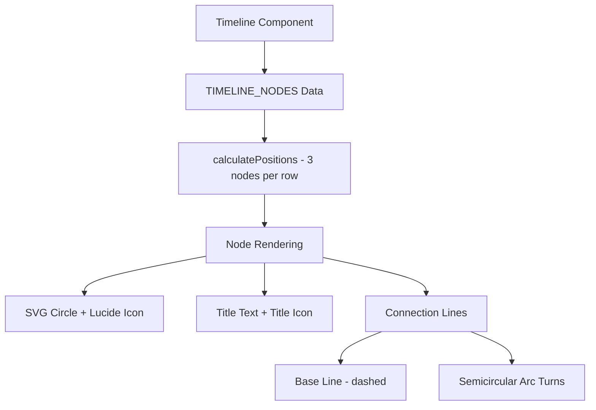

# Design Document

## Overview

This design extends the existing Timeline component to support optional title icons, adds two new milestones, and implements a snake layout with semicircular turns for all screen sizes.

## Steering Document Alignment

### Technical Standards (tech.md)
- Uses Next.js Image component for optimized image loading
- Follows TypeScript strict mode with proper interface extensions
- Uses Tailwind CSS for styling
- Maintains Framer Motion animation patterns

### Project Structure (structure.md)
- Modifies existing component: `src/components/cicd-workflow/Timeline.tsx`
- Uses existing image assets from `public/` directory
- Follows established component patterns in the cicd-workflow folder

## Code Reuse Analysis

### Existing Components to Leverage
- **Timeline.tsx**: Core timeline rendering logic and animation patterns
- **Next.js Image**: Optimized image component for title icons
- **Lucide Icons**: Flag, Milestone, Pickaxe, Rocket, Cog, CircleArrowLeft, SendHorizonal

### Integration Points
- **TIMELINE_NODES array**: Extended with title_icon property
- **TimelineNodeData interface**: Added optional title_icon field
- **SVG path rendering**: Semicircular arc for snake layout turns

## Architecture



## Components and Interfaces

### TimelineNodeData Interface
```typescript
interface TimelineNodeData {
  id: string;
  title: string;
  date: string;
  icon: LucideIcon;
  title_icon?: string;
}
```

### TIMELINE_NODES Array (6 nodes)
```typescript
const TIMELINE_NODES: TimelineNodeData[] = [
  { id: 'start', title: 'Start', date: 'Feb 2026', icon: Flag },
  { id: 'tech-decision', title: 'Tech Decision', date: 'Mar 2026', icon: Milestone, title_icon: '/codeup.png' },
  { id: 'implementation', title: 'Implementation', date: 'Apr 2026', icon: Pickaxe },
  { id: 'enable-coach', title: 'Enable One Coach', date: 'Jun 2026', icon: Rocket },
  { id: 'adopt-jenkins', title: 'Adopt Jenkins', date: 'FY27', icon: Cog, title_icon: '/jenkins-color.png' },
  { id: 'optimization', title: 'Continuous Optimization', date: 'Future', icon: CircleArrowLeft },
];
```

### Snake Layout Calculation
- 3 nodes per row for all screen sizes
- Odd rows reversed for snake pattern
- Semicircular arc (radius = verticalSpacing / 2) with sweep=1 for outward curve

### SVG ViewBox Calculation
```typescript
const svgWidth = paddingX * 2 + 2 * horizontalSpacing;  // 3 nodes = 2 gaps
const svgHeight = paddingY * 2 + (rowCount - 1) * verticalSpacing + 30;
```

## Node Sizing
```typescript
const NODE_SIZE = {
  diameter: 40,
  iconSize: 20,
  horizontalSpacing: 120,
  verticalSpacing: 100,
  paddingX: 60,
  paddingY: 40,
};
```

## Error Handling

- Title icon `onError` handler hides broken images gracefully
- Conditional rendering for optional title_icon
- Layout remains stable with missing icons

## Testing Strategy

- Visual verification of 6 nodes in snake layout
- Verify semicircular turns curve outward
- Verify title icons on Tech Decision and Adopt Jenkins nodes
- Verify responsive behavior at different viewport sizes